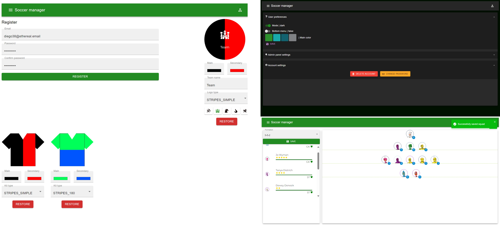
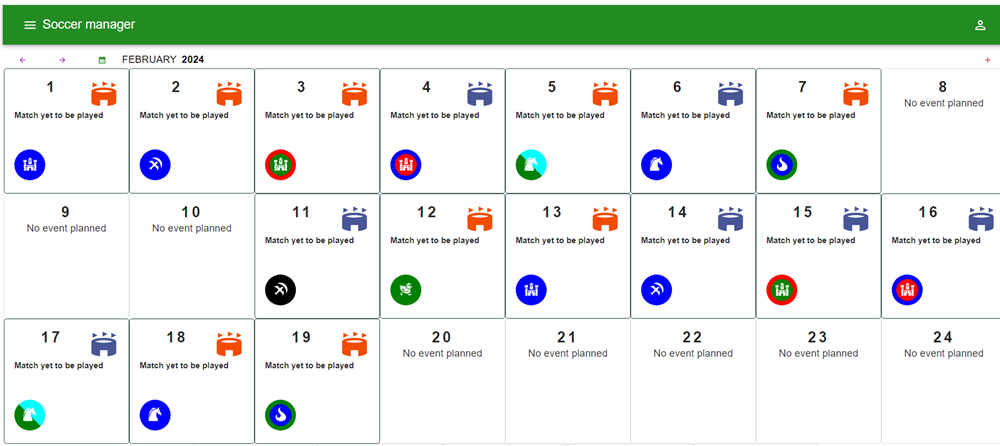
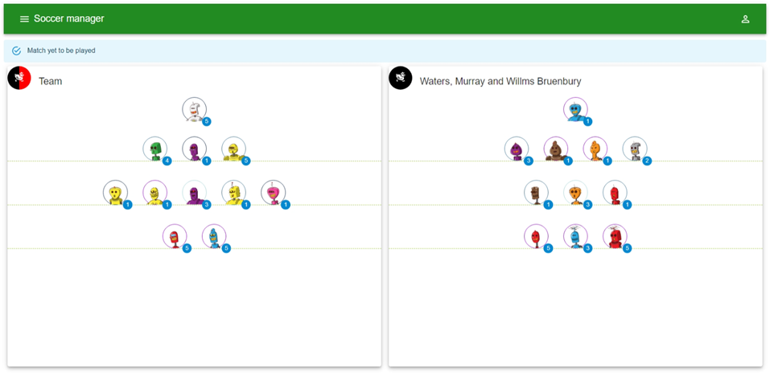

# Projekt inżynierski - manager piłkarski

This project is the part of the solution for engineering thesis. The backend side is located here: [Soccer manager backend](https://github.com/piopta/soccer-manager-backend)

## Contents

- [Technologies](#technologies)
- [Examples](#examples)

## Technologies

- React 18
- TypeScript
- Apollo
- React Query
- Material UI

## Examples

